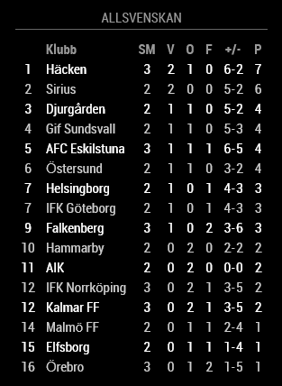

# MMM-AllsvenskanStandings

A [MagicMirror²](https://github.com/MagicMirrorOrg/MagicMirror) module that shows the current standings of [Allsvenskan](https://www.allsvenskan.se) (the top Swedish football league).



The standings are fetched from the Swedish [Text TV API](https://texttv.nu/blogg/texttv-api) ([page 343](https://www.svt.se/svttext/web/pages/343.html)) as HTML and then scraped. So if the Text TV page change its appearance, the module will most likely break.

The standings are refreshed every 10 minutes (currently hard coded).

## Installation

1. Clone repo

  ```shell
  cd MagicMirror/modules/
  git clone https://github.com/retroflex/MMM-AllsvenskanStandings
  ```

2. Add the module to the ../MagicMirror/config/config.js, example

  ```javascript
    {
      module: 'MMM-AllsvenskanStandings',
      header: 'Allsvenskan',
      position: 'bottom_right',
      config: {
        showPosition: false
      }
    },
  ```

## Configuration

| Option                   | Description
| -------------------------| -----------
| `showPosition`           | Whether to show column with position before the team name.<br />**Default value:** true
| `showMatchesPlayed`      | Whether to show column with number of matches played.<br />**Default value:** true
| `showWins`               | Whether to show column with number of matches won.<br />**Default value:** true
| `showDraws`              | Whether to show column with number of matches drawn.<br />**Default value:** true
| `showLosses`             | Whether to show column with number of matches lost.<br />**Default value:** true
| `showGoalsFor`           | Whether to show column with number of goals made.<br />**Default value:** false
| `showGoalsAgainst`       | Whether to show column with number of goals let in.<br />**Default value:** false
| `showGoalDifference`     | Whether to show column with goal difference (i.e. goals made minus goals let in). Is always prefixed by + or -.<br />**Default value:** false
| `showGoalsForAndAgainst` | Whether to show column with number of goals made and let in. See the +/- column in the above screenshot.<br />**Default value:** true
| `showPoints`             | Whether to show column with points.<br />**Default value:** true

## Customize Looks

These items have own class names and can be customized via CSS (see [css/AllsvenskanStandings.css](https://github.com/retroflex/MMM-AllsvenskanStandings/blob/master/css/MMM-AllsvenskanStandings.css) for example).

* Header table row
* Even table rows
* Odd table rows
